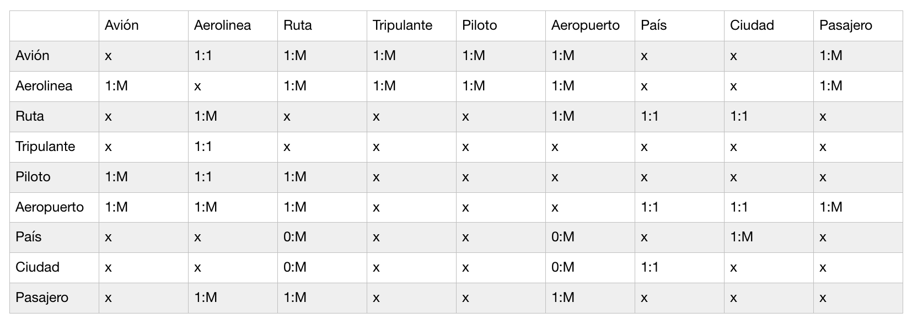
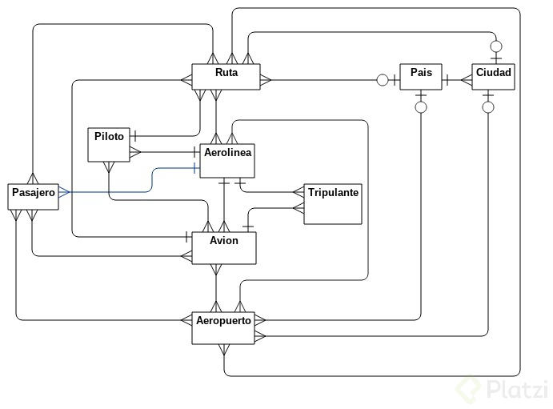
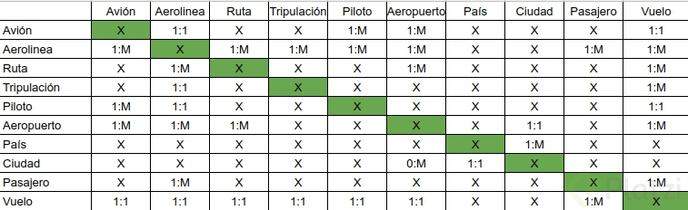
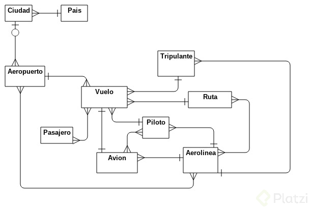
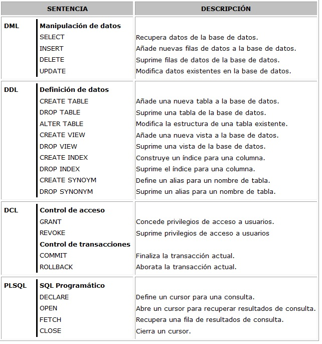

# Fundamentos de BD #

### Propósito general de las Bases de Datos ###
***

- Las **Bases de Datos** surgen de la idea de tener un espacio dónde poder almacenar de una forma mucho más eficiente toda la información de nuestros proyectos. Anteriormente este almacenamiento era en papel, y aunque a la fecha algunas empresas por temas de regulación lo siguen haciendo en parte así, el tener una **Base de Datos** ha permitido tener mucho más control de la información.

- Los **datos no son información.** Solo en el momento que creamos un reporte que contenga ciertos datos, éstos se convierten en información.

- **DBMS** = Data Base Management System o **SGBD** = Sistemas de Gestión de Bases de Datos.

 

### Tipos de Bases de Datos y sus aplicaciones en la industria ###
***

Las **Bases de Datos** se pueden dividir en:

- **Bases de Datos Relacionales**
- **Bases de Datos no Relacionales**

**Bases de Datos Relacionales** empresariales (más importantes):

- **DB2**
- **SQL Server**
- **Oracle**

Algunas **Bases de Datos Relacionales** comunes:

- **MariaDB:** Es una distribución de Bases de Datos que deriva de MySQL.
- **PostrgreSQL:** Esta es una Base de Datos comunitaria pero tiene una versión entreprise que tiene soporte.

Algunas **Bases de Datos No Relacionales** comunes:

- **Redis:** Una Base de Datos que en la actualidad se trabaja mucho.
- **neo4j:** Es una Base de Datos basada en nodos. Está centrada en grafos que nos va a permitir encontrar relaciones entre objetos. Muy común en eCommerce.
- **Cassandra:** Es una Base de Datos muy importante del proyecto Apache. Trabaja con grandes volúmenes de datos.
- **MongoDB:** Es una Base de Datos en NoSQL que se basa en trabajar en varias instancias.

 

### Visión general de los datos ###
***

**¿Qué es un dato?**

Un dato es algo que nos va a permitir describir un objeto. Ese objeto global lo vamos a poder llamar “Entidad”. Una entidad puede estar llena de datos.

Existen **3 niveles de Abstracción** en las **Bases de Datos:**

- **Conceptual:** Se tiene que empezar a modelar una Base de Datos dependiendo de lo que se quiere hacer basado en los conceptos de “entidad” y “relación”.
- **Lógico:** El diagrama lógico nos va a resolver ciertas dudas de consistencia, para evitar crear loops o evitar que tenga cosas que no tengan sentido en nuestro proyecto.
- **Físico:** Es finalmente cómo lo va a ver la Base de Datos.

 

### Tipos de Datos ###
***

Igual que en cualquier lenguaje de programación, existen **variables** en las **Bases de Datos:**

- **Caracteres:** Pueden ser desde letras hasta caracteres especiales.
- **Numérico:** Del 0 al 9 pero con una longitud especial.
- **Varchar:** Caracteres con un formato más variable.
- **Imagen**
- **Fecha:** Generalmente van acompañadas de una hora.
- **Moneda:** esto facilita todo si se trabaja con diferentes denominaciones.
- **Texto:** Variables que tienen mayor tamaño que un char o que un varchar.
- **Bit:** Se puede trabajar con 1 y 0 o también con verdadero y falso.
- **Decimal**

**Esquema =** Es la estructura lógica que va a tener una Base de Datos.  
**Instancia =** Contenido de partículas que tiene una Base de Datos en un instante de tiempo.

¿Qué debemos esperar para modelar una **Base de Datos**?

- Los datos.
- La relación que existe entre los datos.
- Restricciones de los datos.

Existen 3 cosas para poder hacer la descripción de una **Base de Datos:**

- **DML =** Data Manipulation Language o Lenguaje de Manipulación de Datos.
- **DDL =** Data Definition Language o Lenguaje de Definición de Datos.
- **SQL =** Structured Query Language o Lenguaje de Consulta Estructurada.

**Otros tipos de Bases de Datos:**

- Bases de Datos Relacionales
- Basadas en Objetos Relacionales
- XML
- NoSQL
- In-Memory

 

### Diferentes tipos de Bases de Datos ###
***

**Características de Bases de Datos SQL:**

- Es un lenguaje estructurado.
- Tiene un esquema de tablas.
- Tiene integración con otros tipos de archivos.
- Tiene indexación por medio de árboles.

**Características de Bases de Datos NoSQL:**

- Se puede trabajar con un lenguaje estructurado o con uno no estructurado.
- Tiene diferente tipo de indexación. Se utiliza normalmente Json.
- Tiene un crecimiento horizontal.

**Características de Bases de Datos Analíticas y de Bigdata:**

- Son de lenguaje no estructurado.
- Tiene integración de muchos sistemas.
- Tiene integración también a sistemas tradicionales y sistemas de engagement.
- Principio “divide y vencerás”
- Se basa en esquemas Scale Out.
- Crecimiento horizontal.

**Características de Bases de Datos basadas en aceleración:**

- Normalmente basadas in Memory.
- Uso de aceleradores como GPU, flash cards, FPGAs.
- Tienen estructuras diferentes, por ejemplo, basadas en nodos.
- Uso frecuente de ambientes empresariales productivos y de datawarehouse.

   

## Bases de Datos Relacionales ##

### ¿Qué es una Entidad? ###
***

**Entidad =** Es una abstracción del mundo real.

**Barker =** Aquí una entidad se representa como una caja, es una caja que va a tener atributos. Estos atributos van a poder ser obligatorios u opcionales.

**Recomendación:** 
El formato para trabajar con los ID debe ser “number”. No siempre va a poder ser así, pero es lo más recomendable.

 

### ¿Qué es una Relación? ###
***

Para definir una **Relación** tenemos que tener en cuenta los siguientes puntos:

**La obligatoriedad:** Ésta se denota con una línea continua.

**Opcional:** Se representa con una línea punteada.

**Datos importantes:**  
El símbolo con el que representamos la característica “de uno a muchos” es con la llamada pata de gallo, que gráficamente es una línea continua con dos líneas en 45 grados en cada lado.

 

### Tener en cuenta ###
***

- Las llaves primarias obligatoriamente van a ser índices.
- Las Bases de Datos indexan con un algoritmo llamado: **Árboles B+**
- Los **Árboles B+** son una estructura que va a tener un tronco, tres raíces, de las cuales se van a ir derivando tres raíces más por cada una, hasta donde sea necesario.
- Por defecto todas las Bases de Datos están indexadas, así no le pongamos índices. Lo que sucede es que la Base de Datos siempre obliga a indexar porque siempre tienen un atributo que está oculto, este atributo es RowID.

 

### Constrains o Restricciones ###
***

- Las restricciones se pueden trabajar desde la Base de Datos. Normalmente las validaciones con restricciones se hacen desde la aplicación, pero es importante tener en cuenta que podemos hacerlo de igual forma desde la Base de Datos.
- Las llaves primarias y las llaves foraneas no solamente tienen la restricción **_Not null_**, sino que además tienen la restricción **_unique_**, no puede haber otra igual.
- Con **_check_**, las validaciones que podemos hacer son: Igual, mayor o igual, menor o igual, mayor qué o menor qué.

 

### Capas de abstracción del modelo Entidad-Relación ###
***

- **Capa Conceptual:** En esta capa vamos a tener varias entidades, aún sin nombre definido. Las entidades van a tener cada una sus llaves primarias y sus atributos, además van a tener relaciones.
Para que existan las relaciones “muchos a muchos” se necesitan llaves foráneas en las entidades.

- **Capa Lógica:** El modelo Entidad-Relación para poder procesar las relaciones “muchos a muchos” las va a partir en entidades que se llaman: Entidades Débiles.

- **Capa Física:** Este modelo va a ser el paso del modelo lógico hacia la representación que ya va a tener la Base de Datos. En esta capa, ya cada uno de los datos empieza a entrar en las clasificaciones según su tipo de dato.

 

### Metodología básica de 9 pasos con Barker ###
***

Para poner en practica los conceptos vistos anteriormente y los 9 pasos con **Barker** modelaremos el sistema de un Aeropuerto.

- **Paso 1:** Vamos a identificar cuáles son las entidades que van a resolver nuestros problema.
_**Recomendación:** Documentarse muy bien acerca del problema que se va a resolver._   
 **Entidades:**
 - Avión
 - Aerolinea
 - Ruta
 - Tripulante
 - Piloto
 - Aeropuerto
 - País
 - Ciudad
 - Pasajero

 

- **Paso 2:** Identificación de las relaciones de las entidades.  
_**Para tomar en cuenta:**_ Pueden existir relaciones entre entidades que se relacione entre ellas mismas.   
**_Nota:_** Esta imagen la compartio un compañero de la clase [@elSharmaz](https://platzi.com/@elSharmaz/).

 

- **Paso 3:** Entidades y Relaciones   
**_Nota:_** Esta imagen la compartio un compañero de la clase [@GOLLUM23](https://platzi.com/@GOLLUM23/). En la relación **Avion - Pasajero** la relación es de **1:M**.  

 

- **Metodología de Diseño (Correcciónes del paso 2 y 3):** Aporte realizado por [@GOLLUM23](https://platzi.com/@GOLLUM23/).   
   
**Diagrama Entidad Relación:**  Aporte realizado por [@GOLLUM23](https://platzi.com/@GOLLUM23/).

 

- **Paso 4:** Asignar atributos a las entidades. 

- **Paso 5:** Generar un diagrama conceptual (entidades, relaciones y atributos).
Las relaciones siempre se van a hacer en 2 sentidos (A con B y B con A).

- **Paso 6:** Modelo lógico.   
Las relaciones se hacen por medio de **entidades débiles**, entre las entidades relacionadas, esto es porque no podemos generar muchas **llaves foráneas** en ambas entidades (fuertes).   
En estas entidades debiles se usan ambas **llaves primarias** de las entidades (fuertes) que tenían relación.   
En las entidades debiles no debería haber tipos de datos **seriales**, estas tendrían que ser integer, ya que las entidades debiles no tienen forma de tener consistencia con esa serialidad.

- **Paso 7:** Identificar nuevos atributos que generan nuestras entidades débiles.

- **Paso 8:** Construir el diagrama del modelo físico.

- **Paso 9:** Pasar al estándar de la base de datos (SQL).

 

### Principios para desarrollar Bases de Datos ###
***

**Atomicidad:** Asegura que yo tenga un conjunto de pasos para llegar a ser una transacción exitosa.

**Consistencia:** Aseguro que tengo un estado válido y pasó a otro estado que sigue siendo válido.

**Aislamiento:** Esta propiedad asegura que una operación no puede afectar a otras. Esto asegura que la realización de dos transacciones sobre la misma información sean independientes y no generen ningún tipo de error. Esta propiedad define cómo y cuándo los cambios producidos por una operación se hacen visibles para las demás operaciones concurrentes. El aislamiento puede alcanzarse en distintos niveles, siendo el parámetro esencial a la hora de seleccionar SGBDs.

**Durabilidad:** (Persistencia). Esta propiedad asegura que una vez realizada la operación, ésta persistirá y no se podrá deshacer aunque falle el sistema y que de esta forma los datos sobrevivan de alguna manera.

 

### Bases de Datos In-Memory (Cambio de árboles a columnar) ###
***

Las bases de datos **tradicionales** (basada en arboles) hacen una búsqueda por cada uno de los datos de la tabla hasta llegar al resultado.

En las bases de datos **In-Memory** (columnares), el esquema de búsqueda seleccion una columna (por ejemplo Identificador) recorriendola hasta llegar al resultado, dando un mejor rendimiento.

 

### DDL (Data Definition Language) y DML (Data Manipulation Languaje) ###
***
Aporte realizado por: [@DanielEdu](https://platzi.com/@DanielEdu/).

 

### CAP ###
***

**Consistency (Consistencia):** Debe retornar un dato válido, me debe permitir a cualquier estructura de su base de datos.

**Availability (Disponibilidad):** Cuando haga una solicitud no me va a importar que nodo del sistema esta *up time* o *down time* o sin funcionamiento. Un dato debe estar replicado en al menos tres nodos.

**Partition (Particionamiento):** Es como yo parto esa información por lo menos en tres nodos para evitar que se pierdan mensajes.

 

### Guia visual de sistemas NoSQL ###
***
Aporte realizado por: [@DanielEdu](https://platzi.com/@DanielEdu/).

 

### Notas ###
***

**Entidad Fuerte:** La constituyen las tablas principales de la BD, que contienen los registros principales del sistema de información y que requieren de entidades o tablasauxiliares para completar su descripción o información.

**Entidad Debil:** Tablas auxiliares de una tabla principal a la que completan o complementan con la información de sus registros relacionados.

**Dependencias Funcionales:**  
 - **Reflexiva =>** Si tengo un dato A puedo llegar a un dato B.  
 - **Aumentativa =>** Si tengo un dato A, C entonces B, C.  
 - **Transitiva =>** Si tengo una tabla A que esta relacionada con una tabla B y tengo un tabla C relacionada con B no tengo que tener relación entre A y C para poder traer los datos de C cuando hago una consulta de A.

**Primera forma Normal:** Principio de Atomicidad, dejar el mínimo valor posible de un dato.

**Segunda forma Normal:** Una tabla 1NF estará en 2NF si y solo si, dada una clave primaria y cualquier atributo que no sea un constituyente de la clave primaria, el atributo no clave depende de toda la clave primaria en vez de solo una parte de ella  (Todos los atributos que no son clave principal deben depender únicamente de la clave principal).

**Tercera forma Normal:** Consiste en que ningún atributo que depende de la **PK**, dependa de otro atributo dato. Es decir, para que los datos estén en 3FN, deben estar en 2FN y **no deben** tener **dependencia transitiva (X->Y->Z).**

**Cuarta forma Normal:** Obligatoriamente no podemos repetir datos en una tabla, solo tenemos combinaciones únicas y todas las llaves van a poder ser si o si obligatoriamente llaves primarias.

**Quinta forma Normal:** Es importante tener 2 tablas que están en 4FN, cada dependencia de union (join) va a estar hecho por claves candidatas y no va puede estar hecho por condiciones que no se vayan a cumplir.

   
### Enlaces de interes ###

[SQL-92](https://es.wikipedia.org/wiki/SQL-92)  
[Barkers Notation](http://www.vertabelo.com/blog/technical-articles/barkers-erd-notation)  
[gliffy](https://www.gliffy.com/)  
[Start UML](http://staruml.io/)  
[Bases de datos orientadas a grafos](https://www.beeva.com/beeva-view/tecnologia/bases-de-datos-orientadas-a-grafos/)  
[Draw IO](https://www.draw.io/)  